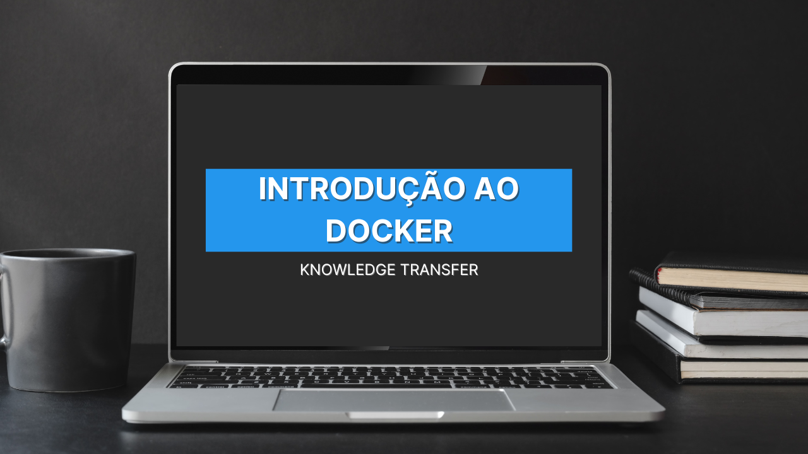

<div  align="center" id="about">
    <h1 align="center">
        Knowledge Transfer — Introdução ao Docker
    </h1>
    <p align="center">
        Este projeto foi desenvolvido como material de apoio para um <strong>Knowledge Transfer (KT)</strong> realizado na <strong>dti digital</strong>, com o objetivo de apresentar os conceitos fundamentais de Docker de forma didática e prática. O repositório contém quatro projetos progressivos que demonstram desde o uso básico de containers até a implementação de aplicações completas usando Docker Compose e multi-stage builds. Cada projeto possui documentação detalhada em português, explicando linha por linha os Dockerfiles, comandos e conceitos envolvidos. O material serve como guia prático para desenvolvedores que desejam compreender e aplicar containerização em seus projetos profissionais.
    </p>
    
</div>
<br>
<div align="center">
    <a href="https://react.dev/" target="_blank">
        
    </a>
    <a href="https://www.typescriptlang.org/" target="_blank">
        
    </a>
    <a href="https://vitejs.dev/" target="_blank">
        
    </a>
    <a href="https://www.docker.com/" target="_blank">
        
    </a>
    <a href="https://github.com/ArturColen/docker-knowledge-transfer" target="_blank">
        
    </a>
    <a href="https://github.com/ArturColen/docker-knowledge-transfer/blob/main/LICENSE" target="_blank">
        
    </a>
</div>

---

<div align="center">
    <p>🇬🇧 <a href="https://github.com/arturbomtempo-dev/docker-knowledge-transfer/blob/main/README.en.md" target="_blank"><strong>English version available here</strong></a></p>
</div>

<br>

<div id="table-of-contents"></div>

## 📋 Tabela de conteúdos

-   [Sobre](#about)
-   [Tabela de conteúdos](#table-of-contents)
-   [Objetivo do Knowledge Transfer](#kt-objective)
-   [Estrutura dos Projetos](#projects-structure)
-   [Demonstração dos Projetos](#projects-demonstration)
-   [Configuração e Execução](#setup-and-run-the-application)
-   [Tecnologias](#technologies)
-   [Autor](#author)
-   [Licença](#license)

<div id="kt-objective"></div>

## 🎯 Objetivo do Knowledge Transfer

Este Knowledge Transfer foi apresentado na **dti digital** com os seguintes objetivos:

-   [x] Introduzir os conceitos fundamentais de **containerização** e **Docker**
-   [x] Demonstrar a evolução de complexidade em projetos Docker reais
-   [x] Ensinar boas práticas na criação de **Dockerfiles**
-   [x] Apresentar o uso de **volumes** para persistência de dados
-   [x] Explicar a orquestração de múltiplos containers com **Docker Compose**
-   [x] Mostrar técnicas de otimização com **multi-stage builds**
-   [x] Fornecer documentação completa em português para cada conceito
-   [x] Preparar desenvolvedores para usar Docker em ambientes profissionais
-   [x] Incluir guia completo de instalação do Docker Desktop para todos os sistemas operacionais

<div id="projects-structure"></div>

## 🗂️ Estrutura dos Projetos

O repositório contém quatro projetos progressivos, cada um introduzindo novos conceitos e complexidade:

### 📦 Projeto 1 — Alpine Docker Demo

**Conceitos:** Introdução básica ao Docker, imagens, containers e Dockerfile.

Um projeto simples que demonstra como criar um container a partir de uma imagem Alpine Linux extremamente leve. Ensina os fundamentos de como containers executam processos e o ciclo de vida básico.

**Tecnologias:** Alpine Linux, Shell Script  
**Documentação:** [project-01-alpine/README.md](project-01-alpine/README.md)

---

### 📂 Projeto 2 — Dockerfile Avançado com Volumes

**Conceitos:** Dockerfiles mais complexos, volumes, ENTRYPOINT, persistência de dados.

Evolui o conceito anterior introduzindo volumes para persistência de dados, uso de ENTRYPOINT para controle do processo principal, e uma estrutura de arquivos mais realista. Demonstra containers de longa duração e a importância de volumes.

**Tecnologias:** Alpine Linux, Shell Script, Docker Volumes  
**Documentação:** [project-02-volume/README.md](project-02-volume/README.md)

---

### 🚀 Projeto 3 — API Node.js com PostgreSQL usando Docker Compose

**Conceitos:** Multi-container, Docker Compose, orquestração, redes Docker, integração de serviços.

Um cenário profissional completo com uma API REST em Node.js conectada a um banco PostgreSQL. Demonstra como usar Docker Compose para orquestrar múltiplos serviços, gerenciar redes internas e volumes de forma declarativa.

**Tecnologias:** Node.js, TypeScript, Express, PostgreSQL, Docker Compose  
**Documentação:** [project-03-compose/README.md](project-03-compose/README.md)

---

### ⚛️ Projeto 4 — Frontend React com Vite e Multi-stage Build

**Conceitos:** Multi-stage builds, otimização de imagens, servir aplicações frontend, Nginx.

Uma aplicação React moderna usando Vite, containerizada com técnica de multi-stage build para gerar imagens extremamente leves. O build é feito em Node.js e o runtime usa Nginx, demonstrando separação entre build e produção.

**Tecnologias:** React, TypeScript, Vite, Nginx, Multi-stage Build  
**Documentação:** [project-04-frontend/README.md](project-04-frontend/README.md)

<div id="projects-demonstration"></div>

## 📲 Demonstração dos Projetos

Todos os projetos estão organizados em pastas individuais, cada uma contendo sua própria documentação detalhada em português.

### 📖 Como Navegar pelos Projetos

Cada projeto possui um arquivo `README.md` completo que explica:

-   **Objetivo do projeto** e conceitos demonstrados
-   **Estrutura de arquivos** e organização
-   **Explicação linha a linha** de todos os códigos (Dockerfile, código-fonte, configurações)
-   **Comandos de execução** passo a passo
-   **Conceitos técnicos** com exemplos práticas

### 🎓 Ordem Recomendada de Estudo

Recomenda-se seguir os projetos na ordem numérica (1 → 2 → 3 → 4), pois cada um constrói sobre os conceitos do anterior:

1. **Projeto 1:** Fundamentos básicos de Docker
2. **Projeto 2:** Conceitos intermediários e persistência
3. **Projeto 3:** Orquestração e multi-container
4. **Projeto 4:** Otimização e práticas profissionais

### 📚 Documentação Adicional

Além dos projetos, este repositório inclui:

-   **[INSTALACAO-DOCKER.md](INSTALACAO-DOCKER.md):** Guia completo de instalação do Docker Desktop para Windows, macOS e Linux, com passo a passo detalhado e solução de problemas.
-   **Arquivos de código fonte comentados** em cada projeto
-   **Exemplos práticos** prontos para execução

<div id="setup-and-run-the-application"></div>

## 📁 Configuração e Execução

### ⚙️ Pré-requisitos

Antes de começar, você precisa ter as seguintes ferramentas instaladas na sua máquina:

-   [Git](https://git-scm.com) - Para clonar o repositório
-   [Docker Desktop](https://www.docker.com/products/docker-desktop/) - Para executar os containers (veja o [guia de instalação completo](INSTALACAO-DOCKER.md))

Também é recomendável utilizar um editor de código como o [Visual Studio Code](https://code.visualstudio.com/).

### 📦 Instalando o Docker

Se você ainda não tem o Docker instalado, consulte o guia completo de instalação disponível neste repositório:

**[📖 Guia de Instalação do Docker Desktop](INSTALACAO-DOCKER.md)**

O guia contém instruções detalhadas passo a passo para:

-   Windows (com WSL 2)
-   macOS (Intel e Apple Silicon)
-   Linux (Ubuntu, Debian, Fedora, RHEL)

### 🚀 Como Executar os Projetos

```bash
# Clone este repositório
$ git clone https://github.com/arturbomtempo-dev/docker-knowledge-transfer.git

# Acesse a pasta do projeto
$ cd docker-knowledge-transfer

# Escolha um dos projetos e entre na pasta
$ cd project-01-alpine

# Siga as instruções do README.md de cada projeto
# Cada projeto tem comandos específicos documentados
```

### 📂 Estrutura do Repositório

```
docker-knowledge-transfer/
├── INSTALACAO-DOCKER.md          # Guia completo de instalação do Docker
├── README.md                      # Este arquivo
├── CITATION.cff                   # Metadados de citação
│
├── project-01-alpine/             # Projeto 1: Introdução básica
│   ├── Dockerfile                 # Definição da imagem Docker
│   ├── app.sh                     # Script de execução
│   └── README.md                  # Documentação detalhada
│
├── project-02-volume/             # Projeto 2: Volumes e persistência
│   ├── Dockerfile                 # Definição da imagem
│   ├── entrypoint.sh              # Script de inicialização
│   ├── app/
│   │   └── log.sh                 # Aplicação principal
│   └── README.md                  # Documentação detalhada
│
├── project-03-compose/            # Projeto 3: Multi-container com Compose
│   ├── docker-compose.yml         # Orquestração de serviços
│   ├── Dockerfile                 # Definição da imagem da API
│   ├── package.json               # Dependências Node.js
│   ├── tsconfig.json              # Configuração TypeScript
│   ├── src/
│   │   └── index.ts               # Código da API
│   └── README.md                  # Documentação detalhada
│
├── project-04-frontend/           # Projeto 4: Frontend com multi-stage build
│   ├── Dockerfile                 # Multi-stage build
│   ├── index.html                 # Template HTML
│   ├── package.json               # Dependências React
│   ├── tsconfig.json              # Configuração TypeScript
│   ├── vite.config.ts             # Configuração Vite
│   ├── src/
│   │   └── main.tsx               # Código React
│   └── README.md                  # Documentação detalhada
│
└── presentation/                  # Material da apresentação (slides)
```

<div id="technologies"></div>

## 💻 Tecnologias

As seguintes ferramentas e tecnologias foram utilizadas nos projetos deste Knowledge Transfer:

### Containerização e Orquestração

-   [**Docker**](https://docs.docker.com/): Plataforma de containerização utilizada em todos os projetos para criar, executar e gerenciar containers.
-   [**Docker Compose**](https://docs.docker.com/compose/): Ferramenta de orquestração utilizada no Projeto 3 para gerenciar múltiplos containers e suas dependências.
-   [**Alpine Linux**](https://alpinelinux.org/): Distribuição Linux extremamente leve utilizada como base nos Projetos 1 e 2.
-   [**Nginx**](https://nginx.org/): Servidor web de alto desempenho utilizado no Projeto 4 para servir a aplicação React em produção.

### Backend e APIs

-   [**Node.js**](https://nodejs.org/): Runtime JavaScript utilizado no Projeto 3 para executar a API REST.
-   [**TypeScript**](https://www.typescriptlang.org/): Superset de JavaScript que adiciona tipagem estática, utilizado nos Projetos 3 e 4.
-   [**Express**](https://expressjs.com/): Framework web minimalista para Node.js utilizado no Projeto 3 para criar a API.
-   [**PostgreSQL**](https://www.postgresql.org/): Banco de dados relacional utilizado no Projeto 3, executado em container Docker.

### Frontend

-   [**React**](https://react.dev/): Biblioteca JavaScript para construção de interfaces, utilizada no Projeto 4.
-   [**Vite**](https://vitejs.dev/): Build tool ultrarrápida e servidor de desenvolvimento utilizado no Projeto 4.

### Scripts e Automação

-   [**Shell Script**](https://www.gnu.org/software/bash/manual/): Scripts utilizados nos Projetos 1 e 2 para demonstrar processos dentro dos containers.

<div id="author"></div>

## 👨🏻‍💻 Autor

---

| [<br><sub>Artur Bomtempo</sub>](https://arturbomtempo.dev/) |
| :--------------------------------------------------------------------------------------------------------------------------------------------------: |

Desenvolvido por Artur Bomtempo 👋🏻. Entre em contato:

[](mailto:arturbcolen@gmail.com)
[](https://www.linkedin.com/in/artur-bomtempo/)
[](https://www.instagram.com/arturbomtempo.dev/)

<div id="license"></div>

## 📜 Licença

Copyright (c) 2025 Artur Bomtempo Colen

Por meio deste, é concedida permissão, gratuitamente, a qualquer pessoa que obtenha uma cópia
deste software e dos arquivos de documentação associados (o "Software"), para tratar
no Software sem restrição, incluindo, sem limitação, os direitos
de usar, copiar, modificar, mesclar, publicar, distribuir, sublicenciar e/ou vender
cópias do Software, e permitir que pessoas a quem o Software seja fornecido o façam, sujeito às seguintes condições:

O aviso de copyright acima e este aviso de permissão devem ser incluídos em todas
as cópias ou porções substanciais do Software.

O SOFTWARE É FORNECIDO "COMO ESTÁ", SEM GARANTIA DE QUALQUER NATUREZA, EXPRESSA OU
IMPLÍCITA, INCLUINDO, MAS NÃO SE LIMITANDO ÀS GARANTIAS DE COMERCIALIZAÇÃO,
ADEQUAÇÃO A UM FIM ESPECÍFICO E NÃO INFRAÇÃO. EM NENHUM CASO OS
AUTORES OU TITULARES DOS DIREITOS AUTORAIS SERÃO RESPONSÁVEIS POR QUALQUER RECLAMAÇÃO, DANOS OU OUTRAS
RESPONSABILIDADES, SEJA EM UMA AÇÃO DE CONTRATO, AGRAVO OU DE OUTRA FORMA, DECORRENTES DE,
OU EM CONEXÃO COM O SOFTWARE OU O USO OU OUTRAS NEGOCIAÇÕES NO
SOFTWARE.
